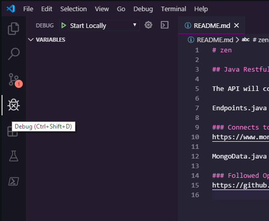

# ZEN

## Java Restful API

The API will contain basic CRUD operations:  https://en.wikipedia.org/wiki/Create,_read,_update_and_delete

Endpoints.java file will bootstrap the API:  `src\main\java\zen\Endpoints.java`

### Connects to Mongo Atlas
https://www.mongodb.com/cloud/atlas

MongoData.java file contains the logic that creates the MongoClient/Connection: `src\main\java\zen\repository\MongoData.java line 33`

### Followed Open Source Example
https://github.com/eugenp/tutorials/tree/master/spark-java

### Running Debug on VSCode
1.  Click on the Debug icon
2.  Click on the `Play Button` to the left of "Start Locally" (see below)

#### Screenshot
